# LinkSentry

A command-line tool to detect phishing URLs using machine learning.

## Features

- 🔍 **Single URL Check** - Quickly analyze any URL for phishing indicators
- 📁 **Batch Processing** - Check multiple URLs from a file
- 🤖 **ML-Powered** - Uses Random Forest trained on 88,000+ URLs with 111 features
- 🌐 **Optional Deep Analysis** - DNS, WHOIS, and SSL lookups with `--full` flag
- 📊 **Multiple Output Formats** - Plain text or JSON output

## Model Performance

Trained on 57,405 URLs (after deduplication) with 80/20 train-test split.

| Metric | Score |
|--------|-------|
| **Accuracy** | 95.76% |
| **ROC-AUC** | 0.9913 |

### Per-Class Metrics

| Class | Precision | Recall | F1-Score | Support |
|-------|-----------|--------|----------|--------|
| Legitimate (0) | 0.96 | 0.95 | 0.95 | 5,382 |
| Phishing (1) | 0.96 | 0.96 | 0.96 | 6,099 |

### Confusion Matrix

|  | Predicted Legitimate | Predicted Phishing |
|--|---------------------|-------------------|
| **Actual Legitimate** | 5,121 (TN) | 261 (FP) |
| **Actual Phishing** | 226 (FN) | 5,873 (TP) |

### Top 5 Important Features

1. `directory_length` (0.114)
2. `time_domain_activation` (0.087)
3. `length_url` (0.046)
4. `qty_slash_url` (0.040)
5. `qty_slash_directory` (0.037)

### Decision Flow (Simplified)

```mermaid
flowchart TD
    A[🔗 Input URL] --> B{Extract 111 Features}
    B --> C[URL Characters]
    B --> D[Domain Analysis]
    B --> E[Path Structure]
    B --> F[External Data]
    
    C --> G{Feature Analysis}
    D --> G
    E --> G
    F --> G
    
    G --> H{directory_length<br/>High importance: 11.4%}
    H -->|Long/Suspicious| I{time_domain_activation<br/>Importance: 8.7%}
    H -->|Normal| J{length_url<br/>Importance: 4.6%}
    
    I -->|New Domain < 30 days| K[⚠️ HIGH RISK]
    I -->|Established| L{qty_slash_url}
    
    J -->|Short URL| M[✅ Likely Safe]
    J -->|Very Long| N{Check Other Features}
    
    L -->|Many Slashes| O[⚠️ PHISHING]
    L -->|Normal| P{Random Forest<br/>100 Trees Vote}
    
    N --> P
    K --> Q[🔴 PHISHING<br/>Confidence: High]
    O --> Q
    
    P -->|Majority: Phishing| Q
    P -->|Majority: Legitimate| R[🟢 LEGITIMATE<br/>Confidence: Based on votes]
    M --> R
    
    style K fill:#ff6b6b,color:#fff
    style O fill:#ff6b6b,color:#fff
    style Q fill:#d63031,color:#fff
    style M fill:#00b894,color:#fff
    style R fill:#00b894,color:#fff
    style A fill:#0984e3,color:#fff
    style P fill:#6c5ce7,color:#fff
```



### Model Architecture


*DNS/WHOIS features require `--full` flag

## Installation

```bash
pip install linksentry
```

For full feature extraction (DNS/WHOIS lookups):

```bash
pip install linksentry[full]
```

## Usage

### Check a Single URL

```bash
# Basic check
linksentry check "https://suspicious-site.xyz/login"

# With full feature extraction (DNS/WHOIS)
linksentry check "https://example.com" --full

# Output as JSON
linksentry check "https://example.com" --json
```

### Check Multiple URLs

```bash
# Check URLs from a file (one URL per line)
linksentry check-file urls.txt

# Save results to CSV
linksentry check-file urls.txt --output results.csv

# With JSON output
linksentry check-file urls.txt --json
```

### Train Custom Model

```bash
# Train with your own dataset
linksentry train --data your_dataset.csv

# Specify output path
linksentry train --data dataset.csv --output custom_model.pkl
```

### Show Model Info

```bash
linksentry info
linksentry info --json
```

## Example Output

```
$ linksentry check "https://secure-login.suspicious-domain.xyz/verify"

⚠️  PHISHING
URL: https://secure-login.suspicious-domain.xyz/verify
Confidence: 94.2%
P(Legitimate): 0.0583
P(Phishing): 0.9417
```

```
$ linksentry check "https://github.com/user/repo"

✅ LEGITIMATE
URL: https://github.com/user/repo
Confidence: 98.7%
P(Legitimate): 0.9871
P(Phishing): 0.0129
```

## Exit Codes

| Code | Meaning |
|------|---------|
| 0 | URL is legitimate |
| 1 | URL is phishing (or at least one phishing URL in batch) |
| 2 | Error occurred |

This allows integration with shell scripts:

```bash
if linksentry check "$URL" > /dev/null 2>&1; then
    echo "URL is safe"
else
    echo "URL may be phishing!"
fi
```

## Feature Extraction

LinkSentry extracts 111 features from URLs:

| Category | Features | Description |
|----------|----------|-------------|
| URL Characters | 18 | Count of special characters in full URL |
| Domain | 21 | Domain length, characters, IP check |
| Directory | 18 | Path analysis |
| File | 17 | Filename analysis |
| Parameters | 20 | Query string analysis |
| External* | 17 | DNS, WHOIS, SSL, response time |

*External features require `--full` flag and `linksentry[full]` installation.

## Dataset Format

For training custom models, your CSV should have:

- 111 feature columns (see feature list above)
- 1 target column named `phishing` (0 = legitimate, 1 = phishing)

## Python API

```python
from linksentry import predict_url, extract_features

# Predict a URL
result = predict_url("https://example.com")
print(result['label'])  # 'legitimate' or 'phishing'
print(result['confidence'])  # 0.0 to 1.0

# Extract features only
features = extract_features("https://example.com", full=True)
```

## License

MIT License

## Contributing

Contributions are welcome! Please feel free to submit a Pull Request.

> **Note:** This README and code documentation were generated with assistance from AI.
